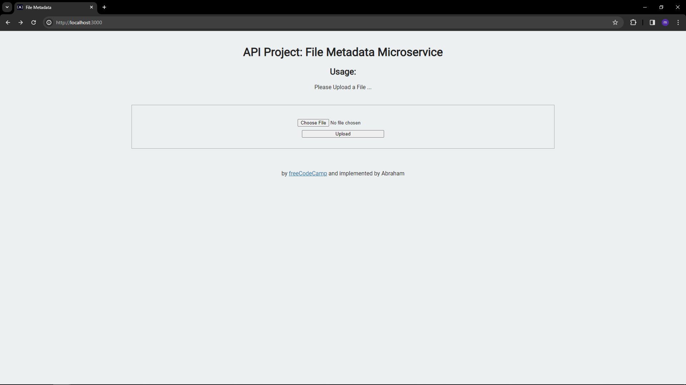

# Exercise Tracker Microservice

This is a simple exercise project from <a href="www.freecodecamp.com">freecodecamp</a>. This time i do not add test.

<h2>Follow these steps to run this project</h2>

<ol>
<li>Git Clone the project</li>
<li>create your own .env</li>
<li>run: npm install</li>
<li>run: npm run watch</li>
<li>Go to http://localhost:3000 or http://localhost:5000 </li>
</ol>

<h3>TO USE</h3>
<ul>
<li> Run the project</li>
<li> upload a file</li>
<li> get the return</li>
<li> Enjoy!</li>
</ul>

<h3>TO RUN TEST </h3>
- run: npm run test-watch

<h3>NOTES</h3>
- Make sure you have node installed
- I make this project ujing Visual Studio Code, so i guess you need to install it too hehehe

<h3>Technology used</h3>
- Node.js
- Express.js
- Jest
- Multer
